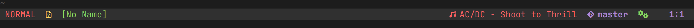

# Music Info
- simple neovim plugin to display some info about the music playing on your computer

## Usage
- install the plugin using your favorite plugin manager
- using lazy
```lua
{
    "MisustinIvan/music_info",
    config = function()
        require("music_info").setup("playerctl")
    end
}
```
- for now, the only supported backend is `playerctl`
- use the `:MusicInfo` command to display the info
- or use ```lua require("music_info").music_info()``` in lua

## Example with lualine

